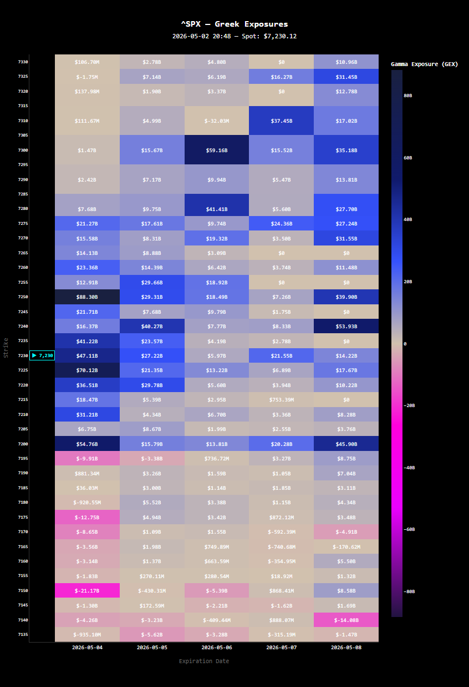

# SPX Greek Exposures Dashboard

Heatmap visualization of **GEX / TEX / Vanna / Charm** across the nearest SPX option expirations.



---

## What it shows

| Greek | What it measures |
|-------|-----------------|
| **GEX** (Gamma Exposure) | Where market makers need to hedge delta — large positive GEX levels act as price magnets |
| **TEX** (Theta Exposure) | Time decay distribution across strikes — where premium is bleeding the most |
| **Vanna** | Sensitivity of delta to IV changes — drives flows when volatility moves |
| **Charm** | Delta decay over time — relevant near expiration as hedging flows accelerate |

Each cell shows the net dollar exposure at a given strike × expiration combination. Color diverges around zero: purple/pink = negative, blue/dark = positive.

---

## Usage

### 1. Install dependencies

```bash
pip install yfinance pandas numpy scipy plotly
```

### 2. Copy and run

Copy `gex_clean.py` into any directory and run:

```bash
python gex_clean.py
```

The dashboard opens automatically in your browser.

---

## ⚠️ Important — when to run it

**Run this during US market hours, ideally after the open (9:30 AM New York time).**

yfinance pulls free, delayed data from Yahoo Finance. Outside market hours, open interest and implied volatility data is stale or incomplete, which will produce a sparse or misleading heatmap.

The script fetches data for multiple expirations and computes Greeks for every strike — **give it 15–30 seconds** before the browser opens. This is normal, it's not frozen.

If a specific expiration fails silently, it's a yfinance rate limit — just re-run after a few seconds.

---

## Configuration

All parameters are at the top of the file:

```python
SYMBOL        = "^SPX"   # ticker — SPY, QQQ, etc. also work
N_EXPIRATIONS = 5        # number of expirations to load
STRIKE_RANGE  = 100      # points above/below spot to display
STRIKE_STEP   = 2.5      # strike grid resolution
```

---

## Limitations

- **Free data only** — yfinance is not a professional data feed. IV and open interest may differ from your broker.
- **No real-time updates** — this is a snapshot. Re-run manually to refresh.
- **SPX-focused** — works on any optionable ticker but strike grid and scale are tuned for SPX.
